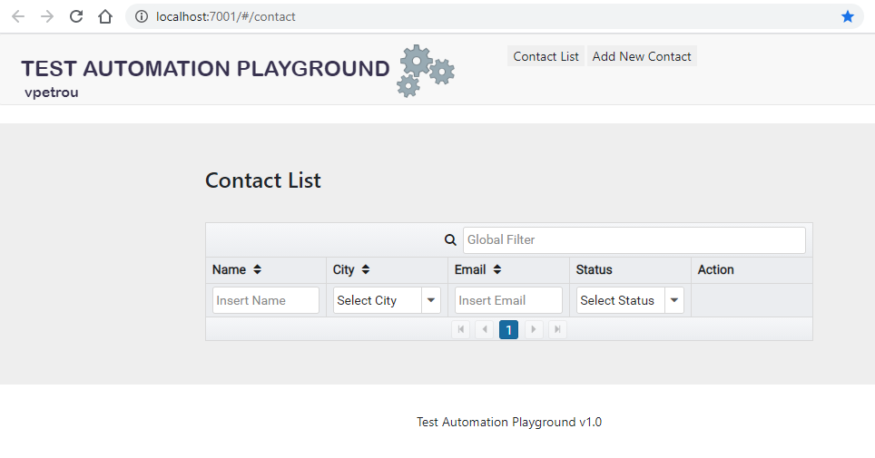
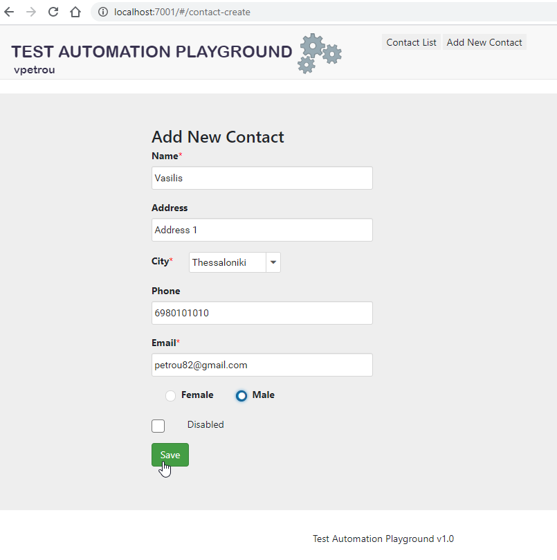
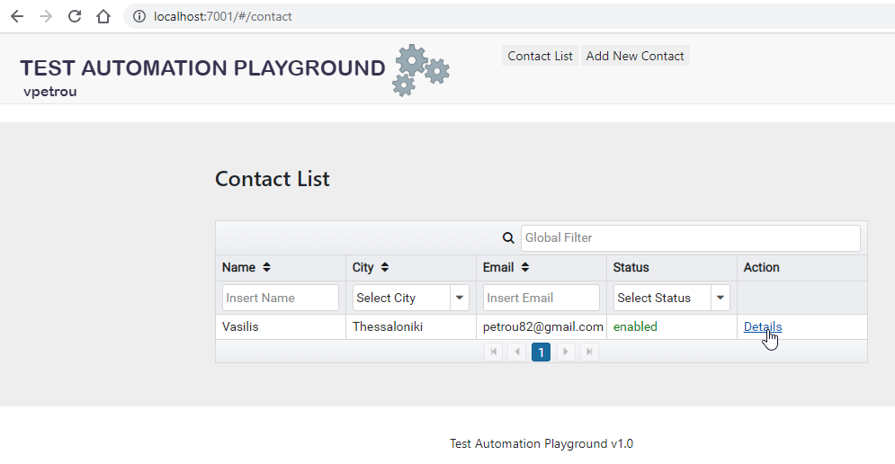
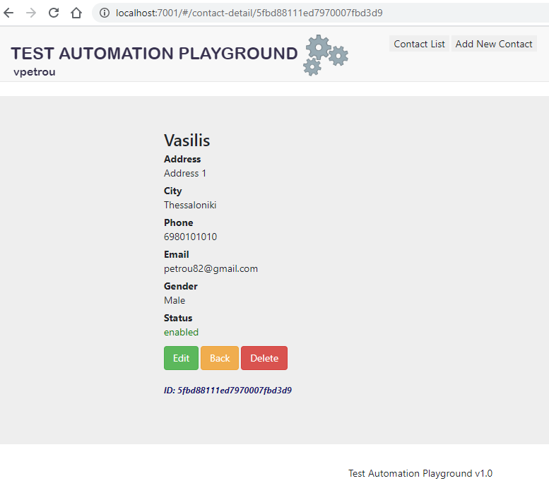
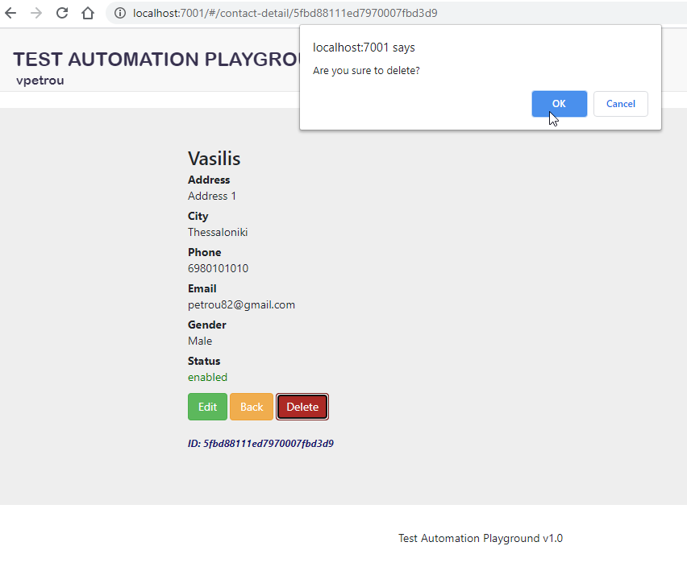
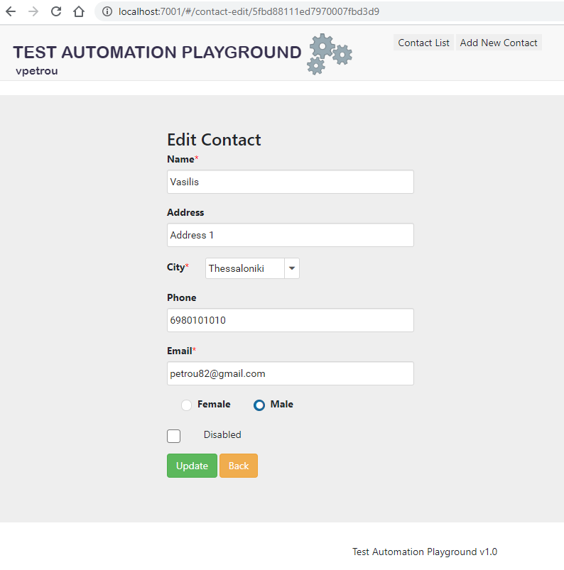
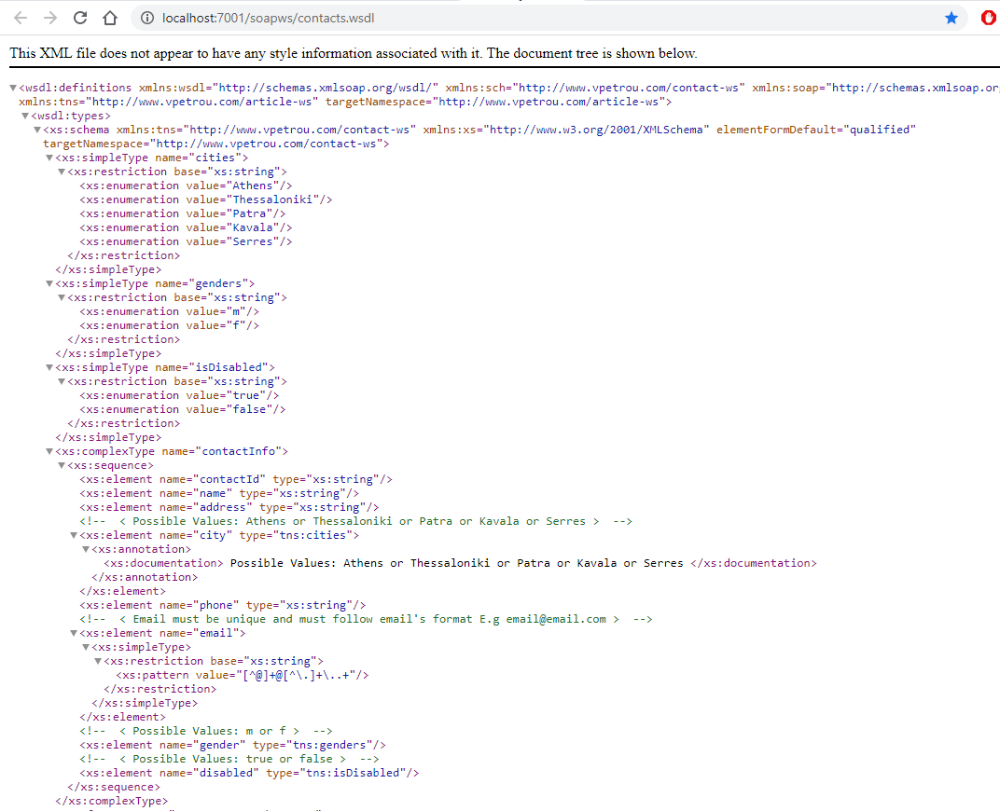
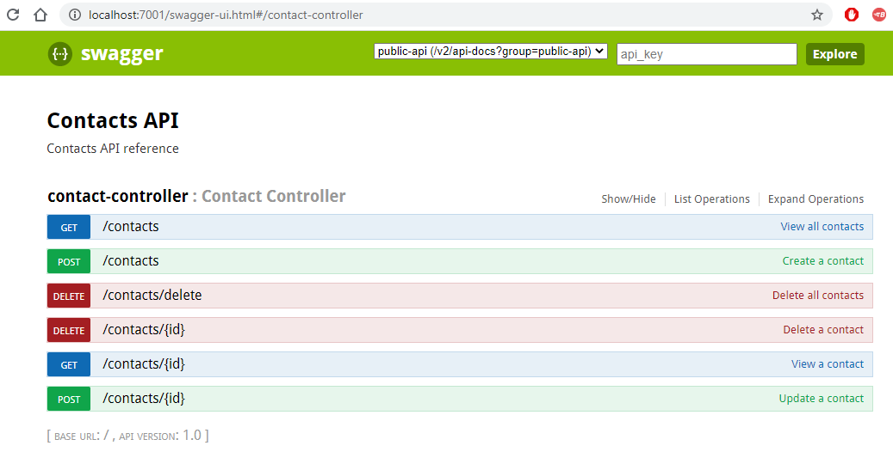

<h1>CRUD Application with GUI, Soap & Rest WebServices</h1>
<i>Vasilis Petrou</i>

<h3>Contacts Management System</h3>

<b>Technologies:</b> Java, Spring Boot, MongoDB, Angular 6 with PrimeNG and Material Components.

<b>Scope:</b> Test Automation Practice

<b>Installation:</b>
- Download & Install Docker https://docs.docker.com/get-docker/
- Download & Install Maven http://maven.apache.org/download.cgi
- Download & Install JDK8 https://www.oracle.com/java/technologies/javase/javase-jdk8-downloads.html
- Download & Install GIT Bash for Windows (only if your OS is Windows) https://git-scm.com/downloads 
- Open CMD/GIT Bash, navigate to root folder and run the commands:

        mvn clean install
        run.sh
        
- To stop demo-app just click CTRL + C on the console window.

Web Application URL: http://localhost:7001/
 Swagger URL (REST API Documentation): http://localhost:7001/swagger-ui.html
 WSDL URL (SOAP API Documentation): http://localhost:7001/soapws/contacts.wsdl

MongoDB:
- host: localhost
- port: 27017

<h4>UI Specifications</h4>

URL: http://localhost:7001/

The application refers to a "Contacts Management System".
There are 2 basic links:

- Contact List 
- Add new Contact

Contact List is opened as Home Page.

&nbsp;&nbsp;&nbsp;&nbsp;&nbsp;&nbsp;

<h5>Add New Contact</h5>

"Add New Contact" page contains below fields:

- Name (input field)
- Address (input field)
- City (single dropdown field with static content).
- Phone (input field)
- Email (input field)
- Gender (radio-button with labels "Female" and "Male")
- Disabled (checkbox) 
- Action

And a button with label "Save"

&nbsp;&nbsp;&nbsp;&nbsp;&nbsp;&nbsp;

<b>Rules</b>:
- Mandatory fields are: "Name", "City", "Email" (fields "Gender" and "Disabled" are also mandatory, but as checkbox and radio-button they have default values). 
- Email follows email pattern
- Gender "Female" is selected by default
- Disabled checkbox is unchecked by default
- City field contains options: "Athens", "Thessaloniki", "Patra", "Kavala", "Serres"
- Button "Save" is <i>un-clickable</i> until all the mandatory fields will be fulfilled.

<h5>Contact List</h5>

Contact List contains a table with below columns:
- Name
- City
- Email
- Status
- Action

&nbsp;&nbsp;&nbsp;&nbsp;&nbsp;&nbsp;

Additional Information about the view of the page:
- There is a global filter and a filter above each column. 
- Filters for columns City and Status are dropdown elements.
- Table is paginated. And each table page contains up to 5 rows.
- Column Action contains a button with label "Details".
- Status column displays values "Enabled" or "Disabled" in green and red color, respectively. 

<h5>View/Edit/Delete Contact</h5>

Action "Details" opens a new page with the value of field "Name" in bold and higher font-size. 
"View Page" also contains labels and values of below fields:

- Address
- City
- Phone 
- Email
- Gender
- Status
- Action

And 3 buttons with label "Edit", "Back", "Delete"

&nbsp;&nbsp;&nbsp;&nbsp;&nbsp;&nbsp;

<b>Rules:</b>
- All field labels (not values) are in bold and normal font-size. Values of each field resides on the next line.
- At the bottom of the page there is a label with the ID of the contact (ID is an auto-generated value by MongoDB)
- When clicking on “Back” button, application is redirected to the “Contact List” page.
- When clicking on “Delete” button, a pop-up confirmation window appears. When the user clicks “No” it closes the pop-up window and remains to the “View” page. When the user clicks “Yes”, contact is deleted and application is redirected to the “Contact List” page.
&nbsp;&nbsp;&nbsp;&nbsp;&nbsp;&nbsp;
- When clicking on “Edit” button, a page similar to the “Add New Contact” page opens with heading “Edit Contact” 
&nbsp;&nbsp;&nbsp;&nbsp;&nbsp;&nbsp;
- Page “Edit Contact” contains buttons “Update” and “Back”. When clicking on “Back”, it redirects back to the “View” Page. When clicking on “Update”, values are updated and it redirects back to the “View” Page with the updated values, displayed. 

<h4>WS Specifications</h4>

<h5>SOAP Web Service</h5>

URL: http://localhost:7001/soapws/contacts.wsdl
&nbsp;&nbsp;&nbsp;&nbsp;&nbsp;&nbsp;

<b>Available Service Operations of Contacts SOAP Web Service:</b>
- addContact: to add a new contact;
- updateContact: to update a contact;
- deleteContact: to delete a contact;
- getAllContacts: to get a list of all contacts;
- getContactByEmail: to get a contact by Email (email is unique);
- getContactByName: to get all contacts that contain all or part of given name.

<b>Columns of Table Contact:</b>
- contactId: Key, Auto Increment;
- name: Not Null, Alphanumeric;
- address: Alphanumeric;
- city: Not Null, Alphanumeric (possible values Athens or Thessaloniki or Patra or Kavala or Serres);
- phone: Alphanumeric;
- email: Not Null, Alphanumeric, Email Pattern (…@...);
- gender: Not Null, Alphanumeric (possible values: m or f);
- disabled: Not Null, Alphanumeric (possible values: true or false).

<h5>REST Web Service</h5>

URL: http://localhost:7001/swagger-ui.html
&nbsp;&nbsp;&nbsp;&nbsp;&nbsp;&nbsp;

<b>Available Service Operations of Contacts REST Web Service:</b>
- Add a new contact;
- Update a contact (by ID);
- Delete a contact (by ID);
- Delete all contacts;
- View a contact (by ID);
- View all contacts.

<b>Columns of Table Contact:</b>

<i>The DB that is used from REST Web Service is similar with the DB that is used from SOAP Web Service and UI Web Application</i>.
